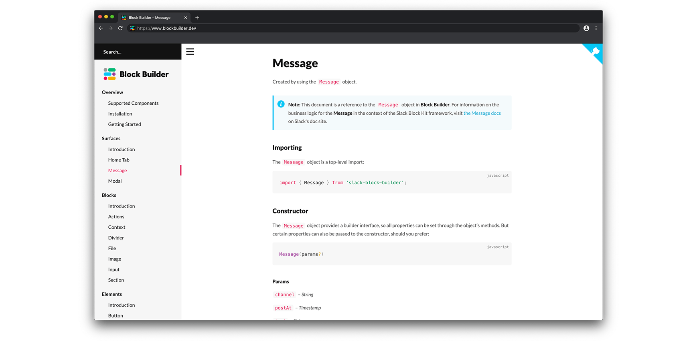

    

    <h4 align="center">Source for <a href="https://blockbuilder.dev">https://blockbuilder.dev</a>, the doc site for <a href="https://github.com/raycharius/slack-block-kit">Block Builder</a>.</h4>

