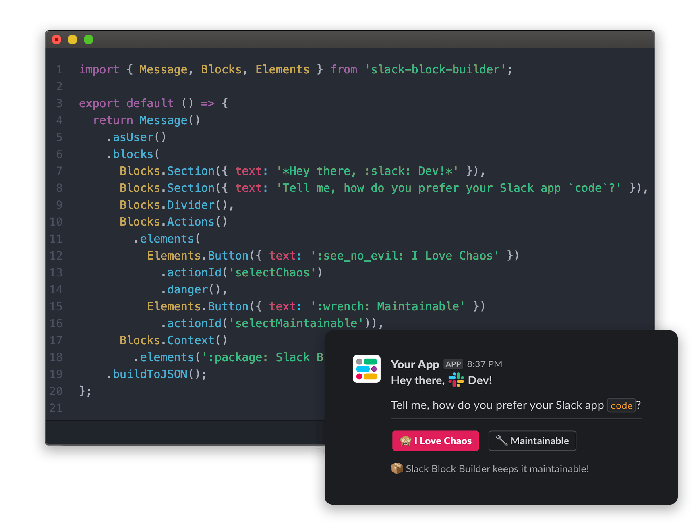

    <h1 align="center">Maintainable code for Slack interactive messages, modals, and home tabs.</h1>

    Lightweight, zero-dependency JavasScript library for <strong>Slack Block Kit</strong>, with a declarative syntax based on SwiftUI.

