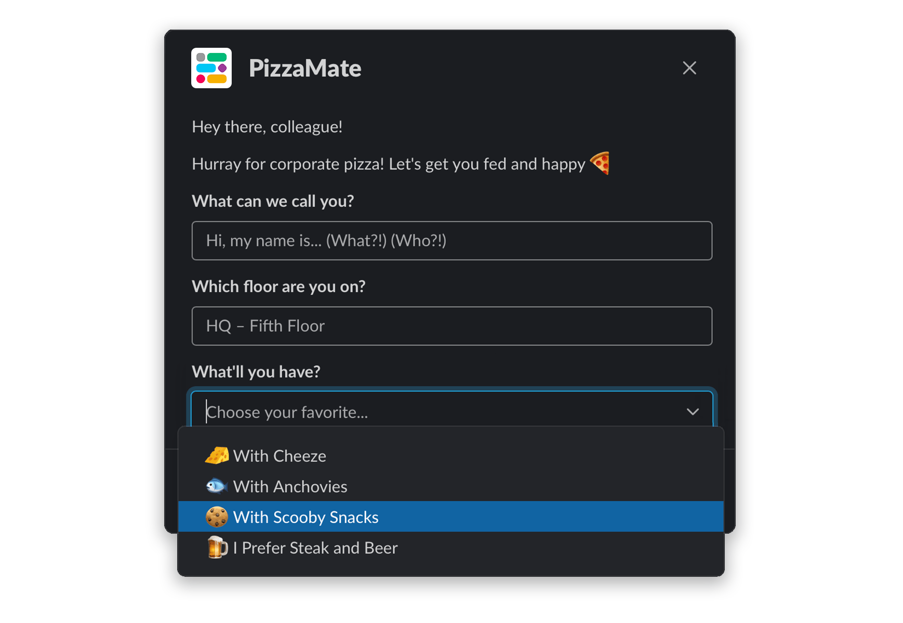

# Example

Below are examples of creating an interactive message and a modal dialog.

### Simple Message

Composing a message with **Block Builder** always starts with the `Message` object:

<!-- tabs:start -->

#### ** Setter Methods + Params **

```javascript
import { Message, Blocks, Elements } from 'slack-block-builder';

const myMessage = ({ channel }) => {
  return Message({ channel, text: 'Alas, my friend.' })
    .blocks(
      Blocks.Section({ text: 'One does not simply walk into Slack and click a button.' }),
      Blocks.Section({ text: 'At least that\'s what my friend Slackomir said :crossed_swords:' }),
      Blocks.Divider(),
      Blocks.Actions()
        .elements(
          Elements.Button({ text: 'Sure One Does', actionId: 'gotClicked' })
            .danger(),
          Elements.Button({ text: 'One Does Not', actionId: 'scaredyCat' })
            .primary()))
    .asUser()
    .buildToJSON();
};
```

#### ** Setter Methods **

```javascript
import { Message, Blocks, Elements } from 'slack-block-builder';

const myMessage = ({ channel }) => {
  return Message()
    .channel(channel)
    .text('Alas, my friend.')
    .blocks(
      Blocks.Section()
        .text('One does not simply walk into Slack and click a button.'),
      Blocks.Section()
        .text('At least that\'s what my friend Slackomir said :crossed_swords:'),
      Blocks.Divider(),
      Blocks.Actions()
        .elements(
          Elements.Button()
            .text('Sure One Does')
            .actionId('gotClicked')
            .danger(),
          Elements.Button()
            .text('One Does Not')
            .actionId('scaredyCat')
            .primary()))
    .asUser()
    .buildToJSON();
};
```

<!-- tabs:end -->

The code from above will create the following interactive message:
<br>
<br>


### Simple Modal

Composing a modal with **Block Builder** always starts with the `Modal` object:

<!-- tabs:start -->

#### ** Setter Methods + Params **

```javascript
import { Modal, Blocks, Elements, Bits } from 'slack-block-builder';

const myModal = () => {
  return Modal({ title: 'PizzaMate', submit: 'Get Fed' })
    .blocks(
      Blocks.Section({ text: 'Hey there, colleague!' }),
      Blocks.Section({ text: 'Hurray for corporate pizza! Let\'s get you fed and happy :pizza:' }),
      Blocks.Input({ label: 'What can we call you?' })
        .element(
          Elements.TextInput({ placeholder: 'Hi, my name is... (What?!) (Who?!)' })
            .actionId('name')),
      Blocks.Input({ label: 'Which floor are you on?' })
        .element(
          Elements.TextInput({ placeholder: 'HQ – Fifth Floor' })
            .actionId('floor')),
      Blocks.Input({ label: 'What\'ll you have?' })
        .element(
          Elements.StaticSelect({ placeholder: 'Choose your favorite...' })
            .actionId('item')
            .options(
              Bits.Option({ text: ':cheese_wedge: With Cheeze', value: '012' }),
              Bits.Option({ text: ':fish: With Anchovies', value: '013' }),
              Bits.Option({ text: ':cookie: With Scooby Snacks', value: '014' }),
              Bits.Option({ text: ':beer: I Prefer Steak and Beer', value: '015' }))))
    .buildToJSON();
};
```

#### ** Setter Methods **

```javascript
import { Modal, Blocks, Elements, Bits } from 'slack-block-builder';

const myModal = () => {
  return Modal()
    .title('PizzaMate')
    .blocks(
      Blocks.Section()
        .text('Hey there, colleague!'),
      Blocks.Section()
        .text('Hurray for corporate pizza! Let\'s get you fed and happy :pizza:'),
      Blocks.Input()
        .label('What can we call you?')
        .element(
          Elements.TextInput()
            .placeholder('Hi, my name is... (What?!) (Who?!)')
            .actionId('name')),
      Blocks.Input()
        .label('Which floor are you on?')
        .element(
          Elements.TextInput()
            .placeholder('HQ – Fifth Floor')
            .actionId('floor')),
      Blocks.Input()
        .label('What\'ll you have?')
        .element(
          Elements.StaticSelect()
            .placeholder('Choose your favorite...')
            .actionId('item')
            .options(
              Bits.Option().text(':cheese_wedge: With Cheeze').value('012'),
              Bits.Option().text(':fish: With Anchovies').value('013'),
              Bits.Option().text(':cookie: With Scooby Snacks').value('014'),
              Bits.Option().text(':beer: I Prefer Steak and Beer').value('015'))))
    .submit('Get Fed')
    .buildToJSON();
};
```

#### ** Working with Arrays **

```javascript
import { Modal, Blocks, Elements, Bits } from 'slack-block-builder';

const myModal = ({ menu }) => { // Pass in an array of menu items from data source
  return Modal({ title: 'PizzaMate', submit: 'Get Fed' })
    .blocks(
      Blocks.Section({ text: 'Hey there, colleague!' }),
      Blocks.Section({ text: 'Hurray for corporate pizza! Let\'s get you fed and happy :pizza:' }),
      Blocks.Input({ label: 'What can we call you?' })
        .element(
          Elements.TextInput({ placeholder: 'Hi, my name is... (What?!) (Who?!)' })
            .actionId('name')),
      Blocks.Input({ label: 'Which floor are you on?' })
        .element(
          Elements.TextInput({ placeholder: 'HQ – Fifth Floor' })
            .actionId('floor')),
      Blocks.Input({ label: 'What\'ll you have?' })
        .element(
          Elements.StaticSelect({ placeholder: 'Choose your favorite...' })
            .actionId('item')
            .options(menu.map((item) => Bits.Option({ text: item.name, value: item.id }))))) // Map items to Option objects
    .buildToJSON();
};
```

<!-- tabs:end -->

The code from above will create the following interactive message:
<br>
<br>

